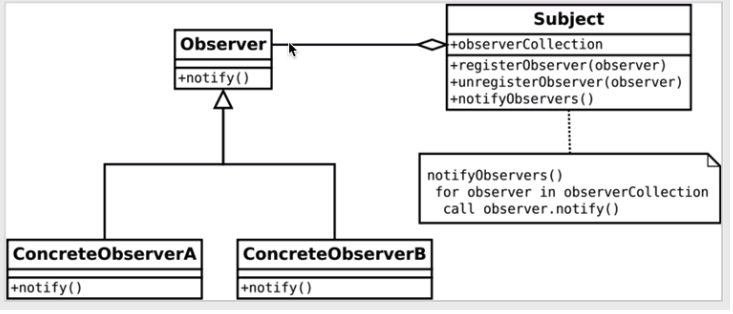

<!-- START doctoc generated TOC please keep comment here to allow auto update -->
<!-- DON'T EDIT THIS SECTION, INSTEAD RE-RUN doctoc TO UPDATE -->
**Table of Contents**  *generated with [DocToc](https://github.com/thlorenz/doctoc)*

- [1. Installation and start up](#1-installation-and-start-up)
- [2. Reactive programming](#2-reactive-programming)
  - [2.1. Reactive Properties of Browser Events](#21-reactive-properties-of-browser-events)
  - [2.2. Relation Between Custom Application Events and Observer Pattern](#22-relation-between-custom-application-events-and-observer-pattern)
  - [2.3. Building an Application Based on a Custom Event Bus](#23-building-an-application-based-on-a-custom-event-bus)
  - [2.4. Global Event Bus (is NOT Scallable in Complexity)](#24-global-event-bus-is-not-scallable-in-complexity)
    - [2.4.1. Implementing a Global Event Bus](#241-implementing-a-global-event-bus)
    - [2.4.2. Broadcast Application Data using the Global Event Bus](#242-broadcast-application-data-using-the-global-event-bus)
    - [2.4.3. Add Support for Different Types of Application Events](#243-add-support-for-different-types-of-application-events)
  - [2.5. An Application Implemented in non-reactive style](#25-an-application-implemented-in-non-reactive-style)
- [3. Observable Pattern](#3-observable-pattern)
  - [3.0. Observable Pattern - The Key Concept of Reactive Programming](#30-observable-pattern---the-key-concept-of-reactive-programming)
  - [3.1. Asynchronous Apps in Reactive Style](#31-asynchronous-apps-in-reactive-style)
  - [3.2. Fix a timing issue](#32-fix-a-timing-issue)
  - [3.3. Introduce in App a new Reactive Pattern: Centralized Store](#33-introduce-in-app-a-new-reactive-pattern-centralized-store)
  - [3.4. The Store and the Observable, closely related](#34-the-store-and-the-observable-closely-related)
  - [3.5. Using RxJs Library, instead of previously discussed concepts](#35-using-rxjs-library-instead-of-previously-discussed-concepts)
- [4. Stateless Observable Services](#4-stateless-observable-services)
  - [4.1. Implementing the API of a Stateless Observable Service](#41-implementing-the-api-of-a-stateless-observable-service)
  - [4.2. Using the Stateless Observable Service](#42-using-the-stateless-observable-service)
  - [4.3. Service Layer API Design: Short-Lived or Long-Lived Observables?](#43-service-layer-api-design-short-lived-or-long-lived-observables)
  - [4.4. Refactoring the view component to Reactive Style](#44-refactoring-the-view-component-to-reactive-style)
  - [4.5. Split Mixed Responsabilities into Smart + Presentational](#45-split-mixed-responsabilities-into-smart--presentational)
- [5. Observable Data Services](#5-observable-data-services)
- [6. Deeply Nested Smart Components/ Component Design](#6-deeply-nested-smart-components-component-design)
  - [6.1. Fixing the Event Bubbling Design Issue](#61-fixing-the-event-bubbling-design-issue)
- [7. Implement a Data Table Pagination Service](#7-implement-a-data-table-pagination-service)
  - [7.1. The Local Service Design Pattern](#71-the-local-service-design-pattern)
- [8. The Master Detail Design Pattern With Cached Master Table](#8-the-master-detail-design-pattern-with-cached-master-table)
- [9. Error Handling in Reactive Applications](#9-error-handling-in-reactive-applications)
- [10. Router Data Pre-Fetching, Loading Indicator and Container Components](#10-router-data-pre-fetching-loading-indicator-and-container-components)
- [11. Laveraging Reactive Forms - Draft Pre-Saving](#11-laveraging-reactive-forms---draft-pre-saving)
- [12. Conclusion](#12-conclusion)

<!-- END doctoc generated TOC please keep comment here to allow auto update -->

REACTIVE:

{

 - WHY: scale insanely, reduce latency

 - Reactive example : Microsoft EXCEL, everything in IT, nowdays is reactive interaction.

 - reactive programming = dataflow computing <-> OBSERVABLE == STREAM OF DATA

 - Programming in reactive + functional style.

 - functional = (functional composition + lazy evaluation);

 - lazy evaluation == efficiency (avoiding things that shouldn't be done in the first place)

 - do not expose your datatabase( never share databases!), instead export your data

}

Understanding the OBSERVABLE PATTERN is the key for understanding RxJs Library and using the operators to programm in a reactive style.

We install YARN = a better package manager, using npm.

YARN is reliable, fast, secure - guarantees that I can have the exact same dependencies trees as someone has. Also is able to freeze my hall dependencies tree in a deterministic way. Build will complete succesfully due to yarn instalation.

# 1. Installation and start up

- ``npm i -g @angular/cli`` to install Angular Command Line Interface

- by default,the setting for each generated component, in angular.json is: ``"prefix": "app",``

- Run : ``ng new --skip-install rxjs-reactive-patterns`` to generate a simple, clean project structure, without dependencies

- ``npm i yarn -g`` to install yarn globally

-  `yarn` after this to quickly install dependencies for this app via YARN

- restart your IDE if you're using it's terminal, to refresh project content

1.0. Development server

Run `ng serve` for a dev server. Navigate to `http://localhost:4200/`. The app will automatically reload if you change any of the source files.

1.1. Code scaffolding

Run `ng generate component component-name` to generate a new component. You can also use `ng generate directive|pipe|service|class|guard|interface|enum|module`.

1.2. Build

Run `ng build` to build the project. The build artifacts will be stored in the `dist/` directory. Use the `--prod` flag for a production build.

1.3. Running unit tests

Run `ng test` to execute the unit tests via [Karma](https://karma-runner.github.io).

1.4. Running end-to-end tests

Run `ng e2e` to execute the end-to-end tests via [Protractor](http://www.protractortest.org/).

1.5. Further help

To get more help on the Angular CLI use `ng help` or go check out the [Angular CLI README](https://github.com/angular/angular-cli/blob/master/README.md).

# 2. Reactive programming

## 2.1. Reactive Properties of Browser Events

Observe the similarities between BROWSER EVENTS and reactive programming:


- we can register a listener (subscrieber) to the browser events (streaming of data about events)

- the listener is a function that is called multiple times - invoked by a third party mechanism

- we cannot trigger events on behalf of the browser

```TypeScript
this.hoverSelection = document.getElementById('hover');
  this.hoverSelection.addEventListener('mousemove', ev => {
    console.log(ev);
  });
```
- for example, above, we are not aware of how the internal browser mechanism for handling mouse moves work.

- we have no access to that mechanism and we cannot, for example trigger mouse events on behalf of the

browser which is actually a good thing. This means that if we want to build programs using the BROWSER EVENTS API,

- we need to build them in a way that we simply declare via certain functions and listener functions, how should we REACT to the arrival of the new event.

- by moving the callback to a separate function we can unsubribe from the sequence of events (the stream of mouse movement events)

```TypeScript
hoverSelection: HTMLElement;

// ..
  ngOnInit() {

  this.hoverSelection = document.getElementById('hover');
  this.hoverSelection.addEventListener('mousemove', onMouseMove);
  }

  unsubscribeFromEventListener() {
    console.log('Called unsubscribeFromEventListener()');
    this.hoverSelection.removeEventListener('mousemove', onMouseMove);
  }

}

function onMouseMove(ev: MouseEvent) {
    console.log(ev);
}
```
- the ability to subscribe and unsubscribe to streams of data is another similarity

BROWSER DOM EVENTS MECHANISM is a general way to handle asynchronous data and we use this general and powerfull concept also in reactive programming.

## 2.2. Relation Between Custom Application Events and Observer Pattern

A PATTERN =  A RECEPIE for how to build software:



Diagram above describes the receipe for implementing application events.

Is about LOOSE COUPLING between different parts of the application.

The Observer is an interface with ``notify`` method that provides new data.

**Is closely related to Browser Events mechanism.**

In the system there are multiple Observers that are observing on the SAME SUBJECT.

An observer wants to receive a notification if a SUBJECT has a a change in internal state,

so is going to register itself on the SUBJECT.

The subject will contain internally a COLLECTION OF REGISTERED OBSERVERS.

Whenever the SUBJECT has a change of internal state is going to notify the each OBSERVER from obeserverCollection, via ``notifyObservers``


Analogies:  Subject         <---------> hoverSelection

            registerEvent   <--------> addEventListener

            unregisterEvent <---------> removeEventListener

            collection of observers <---------> registered callbacks for onMouseMove, onClick methods

            notify          <----------> call the callbacks of onMouseMove  directly

            PUBLIC notifyObservers <---------> ! NO ANALOGIE - THIS IS A MAJOR DIFFERENCE -

            We are NOT ABLE TO TRIGGER EVENTS ON BEHALF OF THE BROWSER (the mouse movement, for example

            is an internal implementation of the Browser, private!

with the Observer Pattern, unlike the case of Browser Events any of the Observers can

trigger the emission of new values for all the other registered Observers.

This is unlike the case of browser callbacks -  we can only register callbacks and get back data.

```TypeScript
// similar to registering the onMouseMove and onClick in Subject's collection of Observers:
  this.hoverSelection.addEventListener('mousemove', onMouseMove);
  this.hoverSelection.addEventListener('click', onClick);
```

## 2.3. Building an Application Based on a Custom Event Bus

``git checkout -b custom-events`` and start implementing inside this new branch

``ng g c event-bus-experiments``

``ng g c lessons-list``

``ng g c lessons-counter``

Event Bus is an Observer interface with a notify method that gets some payload data (as parameter).

The EventBus class is not visible in other components, as we export only an instance of it:

``export const globalEventBus = new EventBus();``

## 2.4. Global Event Bus (is NOT Scallable in Complexity)

 Global Event Bus = is a component communication mechanism (that allows components to interact with each other), without @Input and @Output parameters, but is NOT Scallable in Complexity -

 that's why we USE Reactive Programming INSTEAD.

### 2.4.1. Implementing a Global Event Bus

Install Lodash Library and its type definitons to have the autocomplete available:

``yarn add lodash @types/lodash``

use it: ``import * as _ from 'loadash'``

``_.remove`` method mutates the array that we pass to it by appling the second parameter = a function, to it.

### 2.4.2. Broadcast Application Data using the Global Event Bus

Whenever component is initialized we are going to use the constantant ``globalEventBus``, instance of ``EventBus`` to notify all the subscribed Observers - in this case, we broadcast a list of lessons, to any observers that will need this data.

``globalEventBus.notifyObservers(testLessons);``

EventBusExperiments component, only knows about the ``globalEventBus``.

``LessonsListComponent implements Observer`` otherwise, if it implements the OnInit, the notify wont be called.

### 2.4.3. Add Support for Different Types of Application Events

 - add the `eventType` parameter to the EventBus methods;

 - examples of globalEventTypes: LESSONS_LIST_AVAILABLE, ADD_NEW_LESSON

 - change the collection of registered observers to be a map:

  ``{[key: string]: Observer[]} = {}``

  - add a private method to have a list of observersPerEventType

  - filter the collection of registered observers by event type

  - use a copy of testLessons array, instead of the entier testLessons:

  ``globalEventBus.notifyObservers(LESSONS_LIST_AVAILABLE, testLessons.slice(0));``

## 2.5. An Application Implemented in non-reactive style

 ```git checkout -b custom-events-non-scalable```

- more than one component modifies the same data;

-there are multiple components in the application that are keeping a copy of ``Lessons[]``

- tight coupling between LessonsComponent and the main component

- in the LessonsComponent we have a different array than the one from EventBusExperimentsComponent,

and that's why the operations implemented at the level of LessonsComponent won't propagate to the level of EventBusExperimentsComponent

- define an inline Observer to add as second parameter to register an Observer of type ADD_NEW_LESSON EVENT:

```TypeScript
  globalEventBus.registerObserver(ADD_NEW_LESSON, {
      notify: lessonText => {
        this.lessons.push({
          id: Math.random(),
          description: lessonText
        });
      }
    });
```

- shared data and no clear owner => issues whith DATA ENCAPSULATION

DO NOT USE SUCH IMPLEMENTATION, LIKE THE ONE FROM `custom-events-non-scalable` branch!

# 3. Observable Pattern

## 3.0. Observable Pattern - The Key Concept of Reactive Programming

The main issue with OBSERVER Pattern, as seen above, is that there is no clear separation between registering to get data(`registerObserver`) and the ability to emit that same data(`notifyObservers`) because each observer has access to the SUBJECT- but what we need is that only certain part of the application  should be able to emit certain events!

Changing the OBSERVER into OBSERVABLE to separate the ability to register from the one to observe:

notify           ------> next

notifyObservers  ------> next

registerObserver ------> subscribe

unregisterObserver -----> unsubscribe

The SUBJECT is still comparable to an Event Bus (magistrala):

```TypeScript
export interface Observer {
    next(data: any);
}

export interface Observable {
    subscribe(obs: Observer);
    unsubscribe(obs: Observer);
}
interface Subject extends Observer, Observable {
    next(data: any);
}
```

## 3.1. Asynchronous Apps in Reactive Style

Make maintainable apps without the use of MapGenerators and async.

We simply subscribe to the data and we get notified when the data is available in a transparent way.

- create a copy of the newList and store it at the level of lessons:

```TypeScript
export function initializeLessonsList(newList: Lesson[]) {
    lessons = _.cloneDeep(newList);
}
```
the lessonList$ used all over the app can subscribe to data, but doesn't have access to other different info about the data:

``export let lessonsList$: Observable;``

```TypeScript
export let lessonsList$: Observable = {
    subscribe: obs => lessonsListSubject.subscribe(obs),
    unsubscribe: obs => lessonsListSubject.unsubscribe(obs)
};
```
The `next` API is called on a subject, only at initialization:

```TypeScript
export function initializeLessonsList(newList: Lesson[]) {
    lessons = _.cloneDeep(newList);
    lessonsListSubject.next(lessons);
}
```
and is not accesible over different components!;

## 3.2. Fix a timing issue

We add ``obs.next(lessons);`` to the Observable object, so that any early subscribers will receive an empty array, immediatly and the late subscriber will receive the list of lessons. Otherwise the implementation works only when subscribing in the constructor, and not later on( for example in ngOnInit .., when the late subscriber calls subscribe after the list has initialized):

```TypeScript
export let lessonsList$: Observable = {
    subscribe: obs => {
        lessonsListSubject.subscribe(obs);
        obs.next(lessons);
    },
    unsubscribe: obs => lessonsListSubject.unsubscribe(obs)
};
```
The consummers of the data (lessons-list component that lists lessons, counter component that lists the count of lessons ...) only have access to the Observable(`LessonsList$`), not to the subject.

## 3.3. Introduce in App a new Reactive Pattern: Centralized Store

Use a second pattern in this app, to centralize data in a single place in the app and thus solve the ownership issue;

- after this, data can be modified only in one place of the app:

```TypeScript
class DataStore {
    private lessons: Lesson[] = [];
    private lessonsListSubject = new SubjectImplementation();
    public  lessonsList$: Observable = {
        subscribe: obs => {
            this.lessonsListSubject.subscribe(obs);
            obs.next(this.lessons);
        },
        unsubscribe: obs => this.lessonsListSubject.unsubscribe(obs)
    };
    initializeLessonsList(newList: Lesson[]) {
        this.lessons = _.cloneDeep(newList);
        this.lessonsListSubject.next(this.lessons);
    }
    addLesson(newLesson: Lesson) {
        this.lessons.push(_.cloneDeep(newLesson));
        this.lessonsListSubject.next(this.lessons);
    }
}

export const store = new DataStore();
```
DATA is ENCAPSULATED inside the STORE.

Because the lessons data from the store is not immutable we use:

```TypeScript
    broadcast() {
        this.lessonsListSubject.next(_.cloneDeep(this.lessons));
    }
```

and we have to make sure that no methods that mutate the data exist outside the STORE.

Data is owened be the centralized STORE.

## 3.4. The Store and the Observable, closely related

We transform the Store(`DataStore`) from having an Observable property (`lessonsList$`),
into beeing an Observable.

## 3.5. Using RxJs Library, instead of previously discussed concepts

``git checkout -b introduce-rxjs``

Everything about the lib evolves around Observable, Subject, Obser and the other concepts discussed.

RxJs is a toolkit that allows us to build ASYNCHRONOUS programms around the Observable Pattern.

Angular CLI already added RxJs to app's package.json.

Whenever we create an Observable in the app we need to specify what kind of data is the Observable emitting: `` Observable<Lesson[]>`` - in this case, a list of lessons.

The Observable is directly connected to the Subject.

```TypeScript
    private lessons: Lesson[] = [];
    private lessonsListSubject = new Subject();
    public lessonsList$: Observable<Lesson[]> = this.lessonsListSubject.asObservable();
```
???

So the lessons list observable will emit the values that are broadcasted via this subject but the subject is kept private.

``BehaviorSubject`` - is a Subject Implementantion that remembers previously emitted values.

- Reactive Style = Build  the app by composing separate modules:

- separate components, separate services interact with each other in a decoupled way, by emitting data.

- each module reacts to the arrival of new data,  but it does not know the seaquences of operations that occur in other modules.

- whenever some part of the app needs data, it subscribes to it and provides an Observer

- the Observer knows how that particular part of the app will react to the arrival of new data

- the Subject is a way of sharing an execution of an Observable

# 4. Stateless Observable Services

We use one Google's FireBase for getting data - reading (see fireBase.config.ts for batabase setup and settings), also the AngularFireBase library is Observable based API.

Starting from an imperative style implementation, and refactoring into a reactive implementation.


Imperative:

- keeping local copies of data - mutable data!;

- injecting into component's constructor service:

``constructor(private db: AngularFireDatabase)`` => no separation between service

layer and view layer;

- in couse-detail we encounter an **ANTI-PATTERN: NESTED `.subscribe`**

Reactive:

- no local use of variables data to remove the posibility of mutating data

- Separate Service logic from view logic! = make reusable services/business logic/fdatabase quering


## 4.1. Implementing the API of a Stateless Observable Service

- no member variables that store data in the service

- instead have public methods that expose the data to consumers (`findAllCourses`, `findLatestLessons` ...) - this methods return Observable = provide a callback if and when data is available

- only required singleton instances injected in the constructor (here `db` instance of the global `AngularFireDatabase` service)

- we **don't want to return synchronous data** from such global services

- instead, we want to **return an Observable that emits values** wich are the desired data(array of Courses, in this case):

```TypeScript
    findAllCourses(): Observable<Course[]> {
        return this.db.list('courses')
        .do(console.log);
    }
```
## 4.2. Using the Stateless Observable Service

In the component that renders the view logic ( ex: `home.component.ts`), subscribe to the Observable of the injected service(`coursesService`):

```TypeScript
    this.coursesService.findAllCourses()
        .subscribe(
            data => this.courses = data
        );
```
- delete all dependencies (imports) of `AngularFireBase` from the rendering view components because we what the access at the database only in one place (centralized service for all the queries on that data), thus completly separate bussiness logic from view logic

- use the injected Singleton instance (in this case, our Stateless Observable Service) in all components requiring the data

- the view layer(component), receives data **independently of any timing condition** - that's because we consume  Stateless Observable Services, by subscribing to the Observables of the service

- so, no need for Maping and async of Promisses, instead we use Observables

```TypeScript
    findCoursByApi(courseUrl: string): Observable<Course> {
        return this.db.list('courses',
        {
            query: {
                orderByChild: 'url',
                equalTo: courseUrl
            }
        })
        .map( data => data[0]);
    }
```
At that URl there is only one course, that's why we access with `map`, the first element of the set of values returned by the list method of AngularFireDatabase service.

## 4.3. Service Layer API Design: Short-Lived or Long-Lived Observables?

In case we do not want the live connection between the database and the view layer, and the Observables returned by the service are *Long-Lived*( like the one of AngularFireBase) we apply the `first` method in the Observables returned by the service:

```TypeScript
    findAllCourses(): Observable<Course[]> {
        return this.db.list('courses')
        .first()
    }
```
*Long-Lived* Observables are much more likely to accidentally create memory leaks,

depending on the way that we use them.

## 4.4. Refactoring the view component to Reactive Style

- transform the imperative way of writing code into declarative way:

- a) replace state variables/members (data itself) with the corresponding Observables = INCOMING STREAMS OF DATA like:

```TypeScript
    courses$: Observable<Course[]>;
    // .. all the other required variables
```

- eliminate the `subscribe` call to the Observables, thus eliminate the danger of forgetting to unsubscribe:

```TypeScript
 this.courses$ = this.coursesService.findAllCourses();
 // ... declare all the other streams of data = Observables
 ```
At the level of the template we consume the Observable members using the async pipe:

``courses$ | async`` and assigning the output of this returned stream , to a local template variable, so that we wont use this async call multiple times in the template!

Also for empty stream a data use a local template variable like `noCourses`:

```*ngIf="courses$ | async as courses else noCourses"```

and use the template `noCourses` variable like this:

```HTML
    <ng-template #loadingCourses>
        Loading ...
    </ng-template>
```
## 4.5. Split Mixed Responsabilities into Smart + Presentational

We should respect the SINGLE RESPONSABILITY PRINCIPLE

So, in our home page we can extract:

- one SMART COMPONENT, that cannot be used in other parts of the app

- two PRESENTATIONAL COMPONENTS (templates), reusabale in different parts of the app

Now the `home.component.ts` = the SMART component, is there to:

- simply DEFINE what are the STREAMS OF DATA that the view needs to display

- knows how to get that data - has the service injected into the constructor,

knows how to fetch the data and what is the business meaning of the data

# 5. Observable Data Services

`git checkout -b observable-data-services`

`npm i`, sometimes it fails on some modules, due to compatibilities issues,

 you have to run again `npm i` or run separatly, globally some failing modules

 - better run `yarn` for installing `node_modules`

run: `npm install rxjs@6 rxjs-compat@6 promise-polyfill` to fix rxjs compatibilities issues

`npm run rest-api` from package.json's directory, to start the rest server

`npm start` to serve the app

- to begin with, we have some deeply nested components, taking some `@Input`s(firstname) and emitting some `@Outpput`s (subscribe $event) to the parent components:

- in the including template courses-header.component.ts we pass the input and outputs:

``<app-newsletter [firstName]="firstName" (subscribe)="onSubscribe($event)">``

and in  the newsletter.component.ts:

```TypeScript
@Input()
    firstName: string;

    @Output()
    subscribe = new EventEmitter();
```
- the correct approach is to eliminate the unnecesary bubbling up in the component tree some output events

- keep in memory on client side some necessary user info - don't emit constant requests to the server as we navigate the app, that's why we make an **Observable Data Service** - the user.service.ts = stateless service

- usage: whenever we need to know the state/info about the user we inject the userService in those parts of the app

- keep the ability of emitting data private to the service, behaviourSubject remembers its last emitted value:

``private subject = new BehaviorSubject(UNKNOWN_USER)``, expose only the user data:

``user$: Observable<User> = this.subject.asObservable()``

- the `login` method returns a stream of data (Observable) and we **make sure** that the HTTP POST call, **first** completes, and than emits the value

- we manage **NOT TO** have multiple HTTP calls (guard against the posibility of multiple subscriptions to the Observable), by using ``.publishLast().refCount()``:

```TypeScript
    return this.http.post('/api/login', {email, password})
    .map( response => response.json())
    .do(user => this.subject.next(user))
    .publishLast().refCount();
```
- in the userService we inject the HTTP Angular's service, wich is stateless:

`` constructor(private http: Http) { }``

- userService has no information about who will consume the data in the app, it simply emits the data

# 6. Deeply Nested Smart Components/ Component Design

  ## 6.1. Fixing the Event Bubbling Design Issue

  - to obtain a more specific (inner Observable) - only a specific course, from a more general Observable - all courses, we switchMap to the inner Observable:

```TypeScript
this.course$ = this.route.params
      .switchMap( params => this.coursesService.findCourseByUrl(params['id']));
```
-  the component is only going to be re-rendered if there is a change in one of it's inputs:

``changeDetection: ChangeDetectionStrategy.OnPush``

To avoid bubbling deep down in the component tree and to avoid deeply nested components,

if possible, we transform the presentational components (e.g. newsletter), into a smart components by injecting the required services(e.g. userService) and  removing the `@Input` and `@Output` fields from the upper components in the tree.

Also remove the methods that were only there to bubble the events from the level of the leaf components in the componet tree.

Whenever we subscribe to the `user$` Observable, we are going to initialize the value of the `firstName` property:

```TypeScript
    ngOnInit() {
        this.userService.user$.subscribe(
            user => this.firstname = user.firstName
        )
    }
```

- ``changeDetection: ChangeDetectionStrategy.OnPush`` triggers the re-rendering of components if:

   - some input property changes
   - an `@Output` event is emitted inside the component
   - an Observable to witch the template of the component has subscribed to, using the ` | async` is changed

   So if we have to declare all **changing fields** - getting data from a stream,  as Observables e.g:

```TypeScript
    firstName$: Observable<string>;

    // and we get the data for this Observable by deriving it from user$ Observable, appling the map for each user emitted, we take only the firstName

    ngOnInit() {
        this.firstName$ = this.userService.user$.map(
            user => user.firstName
        )
    }
```
  Conclusion: inject smart components, deep into the component tree, if that makes the implementation simpler.

# 7. Implement a Data Table Pagination Service

    This time we do not use the AngularFireBase, but an HTTP back-end that uses a db data stored in a JSON object on our server side.

    The pagination logic will be present at the level of the service layer (LessonsPagerService)

    If we need to load the pages eachtime from the server, we make the service stateless.

    In case we have, for exapmle, a serchbox on the page with the `Next` and `Prev` buttons, we do not want to repeat the search

    each time we click on another lesson, so we make the service statefull.

   Restart the rest server at need: `nmp restart rest-api`

   Hit the REST server with the following request:

  `http://localhost:8090/api/lessons?courseId=1&pageNumber=1&pageSize=2` and the returned object is:

```
{"payload":
    [
        {
            "url":"angular2-hello-world-write-first-application",
            "description":"Angular Tutorial For Beginners - Build Your First App - Hello World Step By Step",
            "seqNo":0,
            "duration":"2:49"
        },
        {
            "url":"angular2-build-your-first-component",
            "description":"Building Your First Angular Component - Component Composition",
            "seqNo":1,
            "duration":"2:07"
        }
    ]
}
```
In the lessons-pager.service.ts:

```TypeScript
// ..

    private static readonly PAGE_SIZE = 2;
    private subject = new BehaviorSubject<Lesson[]>([]);
    lessonsPage$: Observable<Lesson []> = this.subject.asObservable();
    currentPageNumber = 1;
    // ..
    previous() {
    this.currentPageNumber = (this.currentPageNumber > 1) ? (this.currentPageNumber -= 1) : this.currentPageNumber;
    this.loadPage(this.currentPageNumber);
  }

  loadPage(pageNumber: number) {
    this.http.get('/api/lessons', {
      params: {
        courseId: this.courseId,
        pageNumber,
        pageSize: LessonsPagerService.PAGE_SIZE
      }
    })
    .map(res => res.json().payload)
    .subscribe(
      lessons => this.subject.next(lessons)
    );
  }
```
## 7.1. The Local Service Design Pattern

 - at this point the service is Singleton, so if we create two instances of course component,

  wich has injected this service, both these instances will share the same instance of the Global Singleton

  (we have declared this service at the level of the application module, because we have included in the

  **providers array**, in app.module.ts, the LessonsPagerService)

  - so in such implementation we do not want this service global, but instead local, at the level of the component that uses it

```TypeScript
  @Component({
    selector: 'app-course',
    templateUrl: './course.component.html',
    providers: [
      LessonsPagerService
    ]
})
```
Declaring a **service locally** in a component, we are going to have, **for each instance of that component, a distict instance of the service**,

and, obviously,that instance is visible only in a certion section of a page. And if those services happen to contain state that is used by that

section of the page, that state will be destroyed when the component is itself destroyed.

So the lifecycle of the service is tied to the lifecycle of the component - very **usefull for implementing statefull service**, such as lessons-pager.service,

that is linked to a very specific section of the page. We can have state there, stored for  user experiece purposes and we don't have to worry

about cleaning up that state, because **when the component is destroyed, also the locally declared service is destroyed** (navigating to another app's component,

the `ngOnDestroy` is called) - the state will also be destroyed.

So, any data that it would be holding, if it was a stateful service, like the case of the lessons.service, that data would also be garbage collected,

if it wasn't being referenced by other parts of the application.

Our biggest concern is to avoid keeping references to that state so that it doesn't stay in memory and ends up not being garbage collected.

As seen above, the Angular Dependency Injection system is hierarchical, we do not have to define only global Singleton services.

Fix package vulnerabilities:

For example, parsejson:

 - see the dependency tree: `npm ls parsejson`

        `-- karma@1.7.1

        `-- socket.io@1.7.3

            `-- socket.io-client@1.7.3

            `-- engine.io-client@1.8.3

                `-- parsejson@0.0.3

 - `npm i karma@2.0.0`

# 8. The Master Detail Design Pattern With Cached Master Table

 - the `safeUrl` pipe has to be used with causion on url's that can be modified easily, and are not on server side

 ```HTML
 <div *ngIf="detail$ | async as lessonDetail else masterTemplate">
        <button class="button button-active" (click)="backToMaster()">Back</button>
        <app-lesson-detail [lesson]="lessonDetail"></app-lesson-detail>
    </div>

    <ng-template #masterTemplate>
        ...
        <app-lessons-list [lessons]="lessons$ | async" (selected)="selectedDetail($event)"></app-lessons-list>
    </ng-template>
```
 - when the masterTemplate is hidden, the data is still kept in memory, at the level of LessonsPagerService, because

    in the course component we have:

```TypeScript
// ..

    detail$: Observable<Lesson>;

    constructor(
        private coursesService: CoursesHttpService,
        private lessonsPager: LessonsPagerService) {

    }

    ngOnInit() {
        this.course$ = this.coursesService.findCourseById(this.id);
        this.lessons$ = this.lessonsPager.lessonsPage$;

        //this lessons Observable holds the data of the last incoming stream remembered by the behavioral subject

        this.lessonsPager.loadFirstPage(this.id);

    }
    selectedDetail(lesson: Lesson) {
        this.detail$ = this.coursesService.findLessonDetailById(lesson.url);
    }

    backToMaster() {
        this.detail$ = undefined;
    }
    // ..
```
When we navigate away from the page that displays the course component, the instances of course component will be distroyed,

causing the destruction of it's locally declared service (LessonsPagerService) instances (the subject and the data that the subject

is pointing to, are garbage collected - if we have not kept references to the data else where in the app).

In general, we should not keep references to data in the app. Instead use the observables and the async pipe in templates,

to AVOID MEMORY LEAKS.

# 9. Error Handling in Reactive Applications

We might be tempted to make use of the `error` method of `subject` object, to capture errors at http requests:

```TypeScript
// WRONG IMPLEMENTATION:

this.http.get(
    // ...
    )
    .map(
        // ...
    )
    .subscribe(
      // ...
      err => this.subject.error(err)
    );
```
but this will break subject's functionality: as soon as the subject gets errored one first time, according to the Observable's

contract, we cannot emit values again. So, we **DO NOT ERROR THE OBSERVABLE FROM THE LEVEL OF THE SERVICE**, instead we

**capture errors, at the level of the component that needs to render the errors**, exactly at the specific call to the service (specific error messages in each component).

We refactor service's methods  to return Observables, and at the level of component we call service's methods, by subscribing to the observables,

that allows us to see if the operations suceeded or failed.

WE STILL EMIT THE lessons-pager Observable, to any part af the app that is subscribed to it, by appling `do`, instead of `subscribe`:

```TypeScript
// keep emmiting lessons-pager Observable

this.http.get(
    // ...
    )
    .map(
        // ...
    )
    .do(
      lessons => this.subject.next(lessons)
    );
```
 However, refactoring has to go furter, to the **error handling messages system** = (a component for displaing messages + a global singleton service).

Each value emitted by `errors$` Observable is an array of strings - each string will be an error message:

```  errors$: Observable<string[]> ```

and in the error-messages component's template, iterate over the output of the Observable:

``` <div *ngFor="let message of (messages$ | async)">messages</div>```

In the component that we need to render the error-messages component we inject the service and also, declare the error-messages.service in providers array, thus overwriting the global behavior of the service, with a local behavior.

# 10. Router Data Pre-Fetching, Loading Indicator and Container Components

Benefits of router data pre-fetching:

- improved user experience : we wait for the data to load when navigating to a new page,

we show the loading indicator untill gathering the data for the target screen and when we display the target screen,

we hide the loading icon;

- if the data loading operation fails we can still show an error message on the search screen.

- we can have a loading indicator at a central place and use it in multiple places in the app

Extract the logic for fetching the data from the service layer and move it to a **router data resolver**.

The data `Resolve`, is a tuple that contains both course and lessons info:

```TypeScript
@Injectable()
export class CourseDetailResolver implements Resolve<[Course, (Lesson[])]> {
    constructor(private coursesService: CoursesService) {

    }

    resolve(
        route: ActivatedRouteSnapshot,
        state: RouterStateSnapshot): Observable<[Course, (Lesson[])]> {

            // we have the course id at the level of the ActivatedRouteSnapshot:
            return this.coursesService.findCourseByUrl(route.params['id'])
            /* the swichMap is going to wait for the new value emitted, and

            after that is going to swich into another observable
            but we do not swith directly, first the returned observable that will be a stream of lessons

            will be mapped to the tuple containig the course with it's lessons
            */
            .switchMap(
                course => this.coursesService.findLessonsForCourse(course.id)
                .map(lessons => <any>[course, lessons])
            );
        }

}
```

Inject de resolver into app.module's providers array.

Add the resover in routerConfig:

```TypeScript
    {
        path: 'course/:id',
        component: CourseDetailComponent,
        resolve: {
            detail: CourseDetailResolver
        }
    },
```
this associates the `detail ` data property, to the resolver - will populate the `detail` data.

We are going to use the `detail` data, in the rendering component(course-detail component), like this:

```TypeScript
  ngOnInit() {
      //first part of the Observable tuple is the course:
    this.course$ = this.route.data.map(data => data['detail'][0]);
    this.lessons$ = this.route.data.map(data => data['detail'][1]);
  }
```
The course-detail component is transformed from the previously implementation

as a smart component, into a PLAIN CONTAINER COMPONENT. It simply gets the `ActivatedRoute` injected.

So, at the transition from HOME screen to course screen is going to load the

data tuple(`Observable<[Course, (Lesson[])]>`) returned by the `resolve` method of `CourseDetailResolver`.

the `this.route.data` is actually the observable.

The `resolve` method of `CourseDetailResolver`:

- makes a request to retrive the course by the url

- keeps the result

- makes a second request to fin the lessons for the course

- once the lessons for the course return, a tuple is emitted (`Observable<[Course, (Lesson[])]>`)

So:

- the router will wait for this observable to meet its first value and then complete

- after this the router is going to trigger the transition:

the course-detail will have access to the data, via the `data` Observable

The loading component:


```TypeScript
// ..
export class LoadingComponent implements OnInit {
  loading$: Observable<boolean>;
  constructor(private router: Router) {

  }

  ngOnInit() {
      /*the loading Observable will get the value from the events Observable of the
      router, after appling the map method that returns true or false, depending on the router event type*/
    this.loading$ = this.router.events
    .map( event => event instanceof NavigationStart ||
                    event instanceof RoutesRecognized);
  }
```

We want to hide the loading indicator in most cases but, if the

navigation is started or if the routes have been validated as valid routes,

we want the loading indicator to be shown. If the navigation end or in any other cases we want the loading

indicator to be hidden.


# 11. Laveraging Reactive Forms - Draft Pre-Saving

Let's say we need Draft pre-saveing for a form (create lesson form). If the user navigates to another page in the site,

in the middle of form fields completion, when coming back to form's page, we want the user to see the fields that

he previously completed. So, we have to save a draft, without saveing the form to the server.

This functuonality is hard to implement without reactive programming.

Implementation:

- Add to app.module's `imports` array the `ReactiveFormsModule` to be able to use `[FormGroup]` directive in template

```TypeScript
    ngOnInit() {
        // capture the stream of value changes only for valid field completion
        //and save those valid values to a cookie

        this.form.valueChanges
        //filter is applied to the Observable to only emit the value is the form is currently valid
        .filter(() => this.form.valid)
        .subscribe(console.log);
    }
```
once we have these valid values being captured by this observable, we're going to save the form values

to a cookie, so that whenever the user goes to another screen and comes back here, to

this form screen, we will have somewhere this data saved we will be able to retrieve it from the cookie

and set it in the form.

- add the library for saveing and retrieving cookies at the level of the browser: `yarn add cookies-js`

```TypeScript
        const draft = Cookies.get(CreateLessonComponent.DRAFT_COOKIE);
        // when we access component page and we already have the valueChanges saved in the cookie
        // we set those values into the form - OVERWRITE the hall form
        if (draft) {
            // deserialize the JSON string into an in memory JavaScript Object
            this.form.setValue(JSON.parse(draft));
        }
        this.form.valueChanges
        .filter(() => this.form.valid)
        // the valid value emitted by the observable is saved to a local cookie - DRAFT COOKIE
        .do(validValue => Cookies.set(
            CreateLessonComponent.DRAFT_COOKIE,
            JSON.stringify(validValue)))
        .subscribe(console.log);
    }
```
In the same reactive way we can pre-save the draft on server  side.

# 12. Conclusion

- Reactive Programming as a style of developing asynchronous applications in a maintenable way.

- We use a set of design patterns to cope with asynchronicity in the best way possible, in the most maintainable way.

- A different approach than using generators + async (apparently seqvential programming);

- The core design pattern is the Observable Pattern. The way that this pattern works is:

- we split the app in multiple parts that will interact with each other in a **de-coupled way**,

by exposing some data that they own control of.

- other parts of the application will subscribe to that data, they will not be able to modify the data themselves,

but they can subscribe to a certain type of data that is emitted by a certain part of the application.

- if a part of the app modifies the data that it owns is going to broadcast that change to the other parts of the app,

those subscribed to that data.

- whoever broadcasts the data modification is not aware of what other parts of the system are going to receive the data and what are going to do with it.

- they simply know that a new version of data needs to be emitted

- On the other hand a part of the application that receives a new version of the data that it has subscribed

to will react to the arrival of the new data, for example displaying the data on the screen but it will have no

information about what triggered the modification of that data or what part of the application caused it.

- the modification of the data is done by the **subject** which is an **EVENT BUS**,  is meant to be kept **private** to the

part of the application that owns the data, unless our intention is to create a global event bus, which is usually not the case

because that approach has been shown to not scale in complexity;

- separating the ability of emitting new data via the subject from the ability of subscribing to the data via,

observable = splitting up these still responsibilities is essential.

This is what allows observable patterns to build applications that scale well in complexity.

- RxJs = library in reactive programming style using Observable Pattern, Observer, Store, Subject  in combination.

- the Observable data service pattern for creating statefull services that expose one Observable is an example of

a small store implemented using the `BehaviourSubject`
